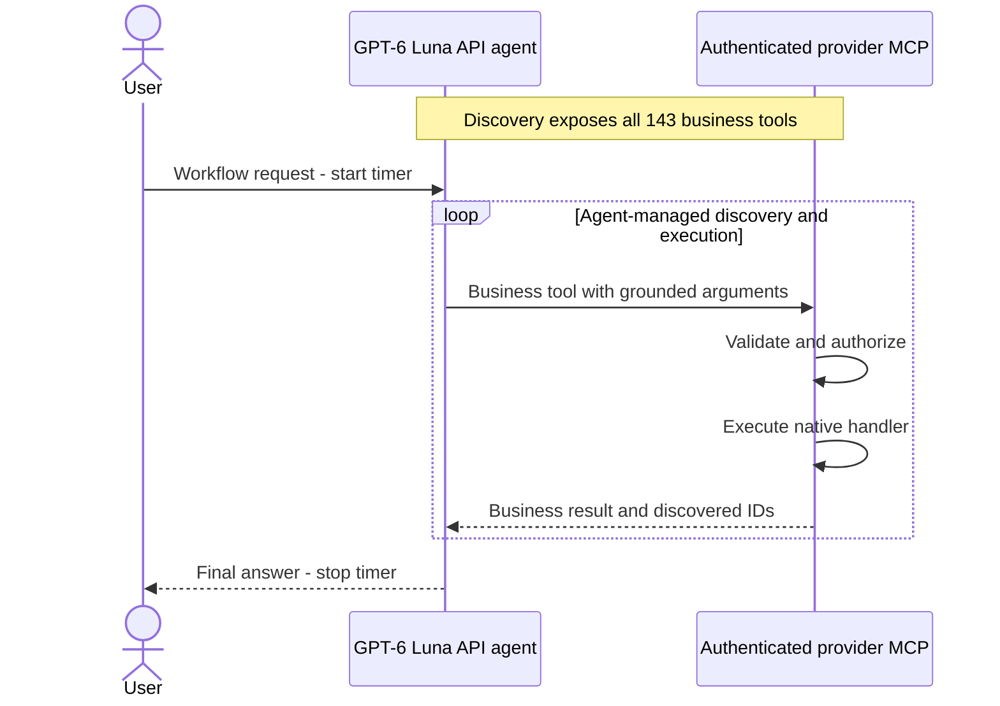
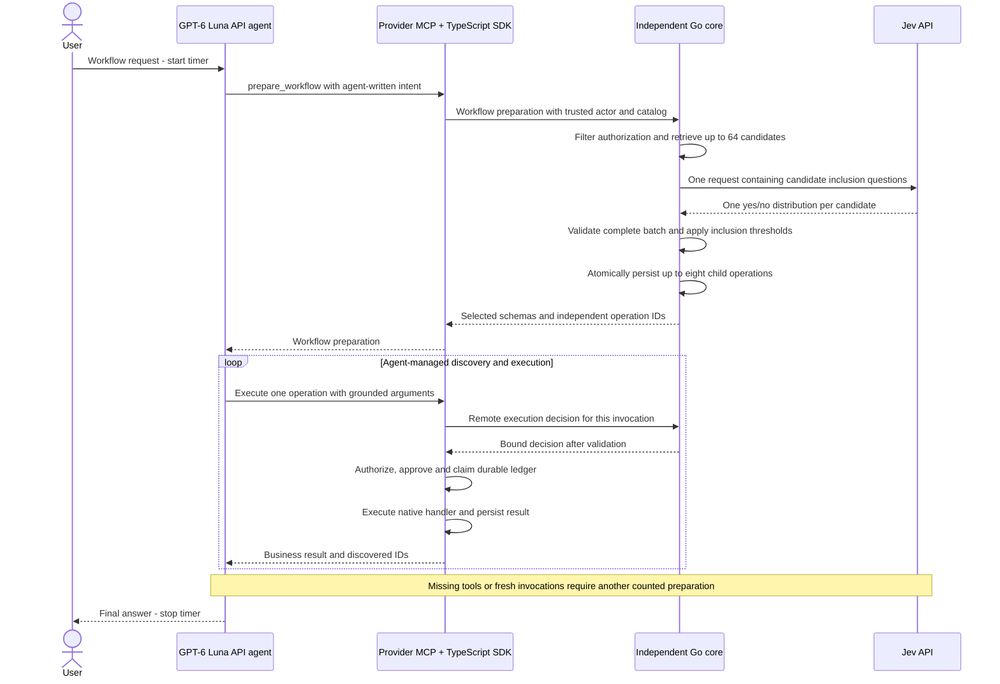
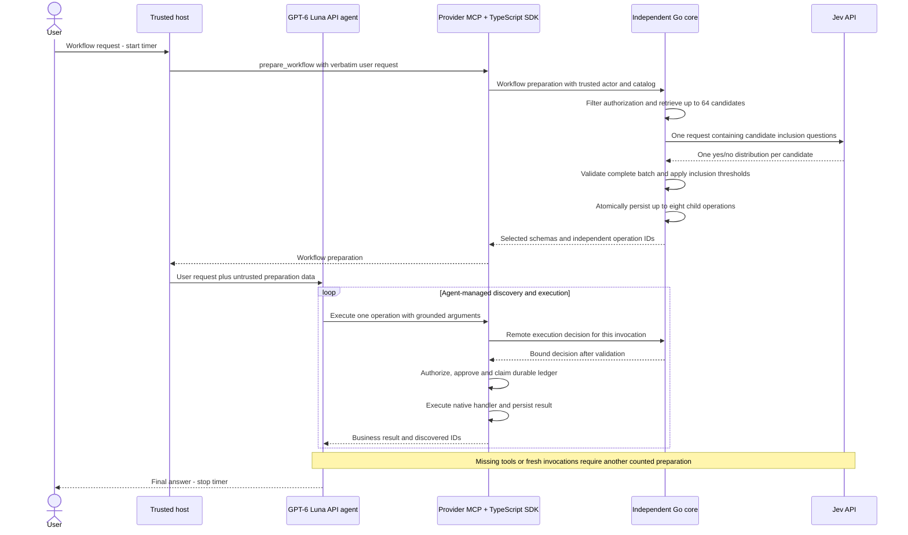
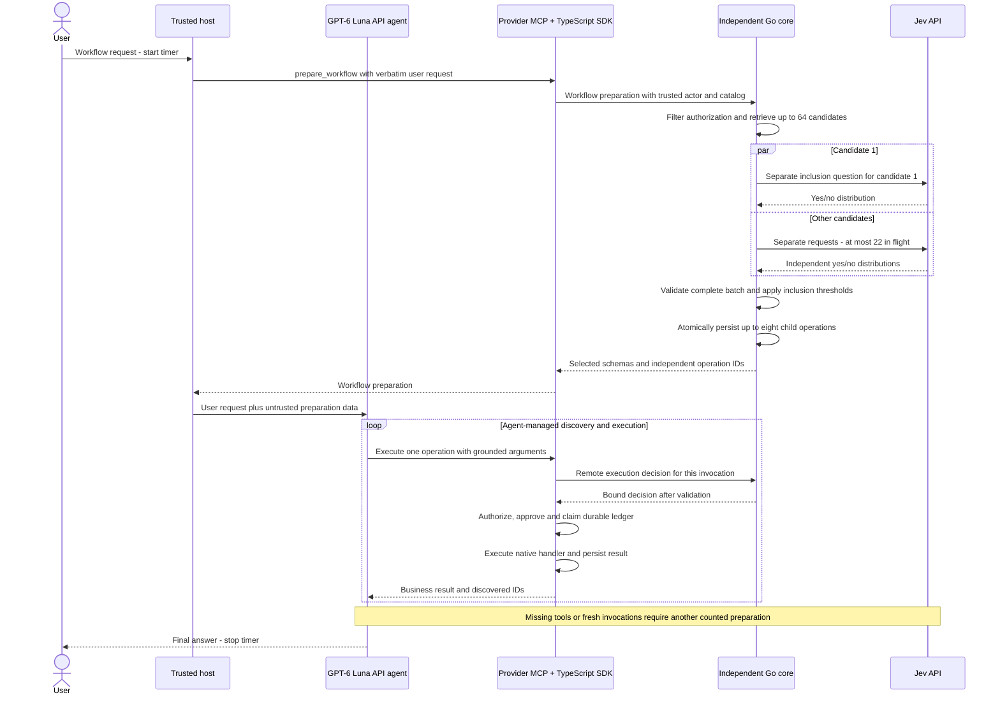

# Toolgate: selecting tools for agent workflows


An experimental comparison of direct MCP and three Toolgate designs, with Go/Rust
cores and one TypeScript SDK. V1 studies latency with 22 read-only tools and Codex;
V2 studies selection accuracy with all 143 active Woku tools and GPT-6 Luna API calls.
V3 extends the same four conditions to dependent multi-tool business workflows.

[V3 part 2: exposure caps](#v3-part-2-exposure-caps-and-successive-discovery) ·
[V3 workflows](#v3-dependent-multi-tool-workflows) ·
[V2 accuracy results](#v2-selection-accuracy-with-the-complete-catalog) ·
[Architecture](#research-question-and-architecture) ·
[V1 single-Choice results](#experiment-1-single-choice-results) ·
[V1 parallel binary results](#experiment-2-parallel-binary-suitability) ·
[Reproduce the experiments](docs/REPRODUCTION.md) ·
[Connect your MCP](docs/PROVIDER_INTEGRATION.md)

## V3 part 2: exposure caps and successive discovery

**750 fresh executions: 30 V3 scenarios x five repetitions x five conditions.**
Only the final exposure cap changes among the host-first joint Toolgate arms.
Preselection (up to 64), Jev questions/thresholds, alphabetical order, Luna prompt,
20-turn/240-second case budget and V3 operation reuse remain fixed. No set is
padded and no follow-up query is forced. Direct and Joint-8 are fresh controls.

| Condition | Complete executions | Scenarios correct 5/5 | Median | p95 | Additional preparations | Estimated API USD |
|---|---:|---:|---:|---:|---:|---:|
| Direct MCP | 150/150 | 30/30 | 13.66 s | 21.64 s | 0 | $0.236797 |
| Joint-1 | 148/150 | 28/30 | 20.62 s | 38.06 s | 568 | $0.594404 |
| Joint-3 | 147/150 | 27/30 | 12.30 s | 23.94 s | 166 | $0.336748 |
| Joint-5 | 148/150 | 28/30 | 9.88 s | 24.35 s | 103 | unknown; known >= $0.300462 |
| Joint-8 | 149/150 | 29/30 | 9.78 s | 21.82 s | 96 | unknown; known >= $0.306325 |

**All 375 mutation cases matched persisted-state expectations, with no improper
mutation invocations.** There were 749 final answers; one Joint-1 case exhausted
its turn budget. The eight incomplete tasks include missing names, missing tracker
labels, wrong saved-report lookup and that turn-limit termination.

In this workload, exposing only one tool increased successive-query overhead:
568 additional preparations, compared with 96 for Joint-8. Joint-5 and Joint-8
had close medians (9.88 versus 9.78 seconds); that 0.10-second difference does not
establish a general winner. Direct MCP completed every scenario in all five
repetitions and had the lowest recorded cost, while taking longer at the median.

Joint-5 and Joint-8 each have one failed Jev attempt without reported token usage.
Their total costs are unknown; the numbers above are known lower bounds. All
attempts and recoveries remain included. Estimates use the fixed price snapshot,
including cache partitions; they are not invoices.

The user-goal criteria were fixed before measurement. The online recognizer had
implementation false negatives: empty-history wording, an affirmative "raised"
confirmation, phone formatting, an unrequested draft-status word, and an explicit
zero-event total supplied through an alternative endpoint. The audit applies the
same semantic requirements uniformly, retains both verdicts, and changes no call,
response, time or cost. Online success was 725/750; audited success is 742/750.
The recognizer corrections are a disclosed deviation from the initial operational
freeze. Final success counts are audited outcomes, not wholly preregistered
automatic scores or blinded human review.

[Comparative report](results/v3p2/report.md) · [Protocol](docs/V3-PART2.md) ·
[Per-scenario paired differences](results/v3p2/summary.json) ·
[Observed exposure and stage losses](results/v3p2/observations.json) ·
[Audit details](results/v3p2/review-notes.json)

This version is committed **locally only**, without a push.

## V3: dependent multi-tool workflows

**143 tools, 30 English requests per condition, 120 evaluated cells.** The corpus
has 15 read workflows and 15 mutation workflows, each needing two or more tool
types. GPT-6 Luna discovers IDs, passes them between calls and produces the answer.
Toolgate returns up to eight schemas as independently executable operations.

| Condition | Initial complete reference coverage | Reference workflow completed | Median task time | Estimated USD per 30 |
|---|---:|---:|---:|---:|
| Direct MCP | n/a | 30/30 | 16.32 s | $0.049039 |
| Design 1: agent first | 21/30 | 29/30 | 13.96 s | $0.060035 |
| Design 2: host first, joint | 17/30 | 30/30 | 11.88 s | $0.060107 |
| Design 3: host first, parallel | 17/30 | 30/30 | 11.29 s | $0.101133 |

All **120 cases produced final answers** and all **60 mutation cases matched the
expected persisted state**, with no non-reference mutation invocations. Agent-first
preparation covered more reference steps initially; further preparation was needed
in 12/30, 14/30 and 14/30 gated cases. Initial coverage is not end-to-end correctness.

The frozen reference metric has two limits visible in this run. Design 1 completed
one folder-report request through a valid alternative path that the reference did
not accept. Separately, designs 1 and 3 answered the team-members question with IDs
and roles but could not resolve names. Direct MCP and design 2 did resolve them.
A **secondary post-run completeness review**, accepting that alternative path and
requiring member names, gives **30/30, 29/30, 30/30 and 29/30** respectively. This is
reported separately; original grades and failed attempts remain unchanged.

Parallel selection had the lowest aggregate median in this run, while joint
host-first selection had the larger median paired improvement over direct MCP
(-4.39 s versus -4.18 s). Neither establishes a general winner. Direct MCP had the
lowest estimated API cost. There were **549 OpenAI calls and 3,298 Jev calls**;
3,200 of the Jev calls came from the parallel condition.

V3 batches one inclusion question per candidate in joint mode and sends those
questions separately in parallel mode. It retrieves at most 64 candidates and
returns at most eight tools. This changes the selection algorithm and agent budget
from V2, so cross-version latency differences are not a controlled causal result.
The authored corpus covers 39 reference tools; it is not a positive test of all 143.

[Full results](results/v3/report.md) · [Protocol](docs/V3-WORKFLOWS.md) ·
[30 workflow requirements](data/v3/corpus.en.json) · [Synthetic fixture](data/v3/fixture.json) ·
[Observations](results/v3/observations.json) · [Interpretation audit](results/v3/review-notes.json) ·
[Verification](verification/v3/VERIFICATION.md)

## V2: selection accuracy with the complete catalog

**143 active Woku tools, 60 English requirements per condition, 240 evaluated cases.**
The evaluated agent is `gpt-6-luna` through the Responses API with `high` reasoning,
not the Codex app server. Go is fixed across the three Toolgate conditions.
The corpus contains 30 reads and 30 mutations, executed by real Woku handlers on
an isolated synthetic database restored before each case.

| Condition | First reference tool | Expected handler succeeded | Median task time | Estimated USD per 60 cases |
|---|---:|---:|---:|---:|
| Direct MCP | 43/60 | 60/60 | 10.48 s | $0.071341 |
| Design 1: agent prepares | 60/60 | 60/60 | 9.53 s | $0.048590 |
| Design 2: host-first Choice | 59/60 | 59/60 | 4.41 s | $0.034459 |
| Design 3: host-first binary | 59/60 | 58/60 | 5.75 s | $0.104033 |

All four conditions produced the requested persisted change in **30/30 mutations**;
no non-target mutation calls were observed. This is a limited synthetic test, not
evidence of production safety. There were 239 final answers: design 1 executed the
expected tool in one case but reached its eight-turn limit before answering.

The first-reference metric excludes `woku_guide`, but counts other preparatory reads.
Direct MCP's 43/60 therefore does **not** mean 17 unsafe or failed tasks: it reached
the expected handler in all 60 cases, often after additional discovery. Design 2
had one invalid selector response. Design 3 had one abstention and one correctly
selected tool whose operation ID the agent copied incorrectly before execution.
All failures remain in the results.

Design 2 had the lowest observed median task time and estimated cost. Design 3 did
not improve correct-tool execution: it made 3,769 Jev requests versus design 2's 63,
with 25 ambiguities that all contained the expected tool. The larger catalog uses
the existing lexical prefilter: at most 64 candidates reach Jev, with binary
concurrency capped at 22. The direct API agent receives all 143 tool definitions.

These are contemporaneous comparisons within V2. V1 used a different model,
catalog and dataset. Costs use published token prices, including cache reads and
writes; they are estimates, not invoices. Task time includes failed/limited cases;
completed-answer latency is also available in the numerical summary.

[Full results](results/v2/report.md) · [Protocol](docs/V2-ACCURACY.md) ·
[60 requirements](data/v2/corpus.en.json) · [143-tool catalog](data/v2/catalog.json) ·
[Observations](results/v2/observations.json) · [Verification](verification/v2/VERIFICATION.md)

## V1 abstract

Toolgate separates tool selection from business execution. A remote Go or Rust
core selects an authorized tool with Jev, while one TypeScript SDK validates the
execution decision and invokes the existing handler inside a provider backend.
We compare direct MCP access, ordinary SDK-mediated selection, and host-first
preparation in which Toolgate selects a tool before Codex begins inference. The
primary outcome is time from question submission to the complete final answer,
including host preparation. Secondary outcomes are query correctness, network
round trips, tokens, cache usage and API-equivalent cost. This repository includes
the implementation, an English experiment harness and sanitized observations. It
does not include the Woku server or private provider data.
In the measured pass, host-first preparation reduced the ordinary SDK's paired
median latency by about four to five seconds, while direct MCP remained faster
overall. The limited catalog, live data, cache variation and observed failures
prevent broader performance or language-ranking claims.
An additional experiment evaluates each tool independently with 22 parallel binary
Choice requests, using fresh single-Choice controls with host-first preparation.

## Research question and architecture

Can a small remotely selected tool set support complete workflows as accurately
as exposing the entire MCP catalog? How do agent-first preparation, host-first
preparation and per-candidate parallel selection affect recovery, time and cost?

The four diagrams show V3. V1 and V2 keep their original methods, source hashes
and observations below. In V3 the agent controls ordering and passes IDs from prior
business results. Toolgate does not execute a workflow. Each operation selects
one tool, and each invocation keeps its remote decision and local durable ledger.

### Control: direct MCP

The API agent receives all 143 schemas and can invoke multiple business tools.
Independent reads can overlap; dependent calls wait for the required results.



### Design 1: agent-first workflow preparation

The agent describes the complete workflow to Toolgate. Jev evaluates one inclusion
question per candidate, batched in one request. The response can contain several
schemas, including prerequisite discovery tools.



### Design 2: host-first joint workflow preparation

The trusted host sends the verbatim user request before Luna begins inference.
The same joint question batch selects a tool set; Luna then controls execution.



### Design 3: host-first parallel workflow preparation

The host prepares before Luna, but each retrieved candidate gets a separate
yes/no Choice request. At most 64 candidates are evaluated with 22 requests in
flight. The core validates every answer before returning any operations.



An empty set abstains. More than eight positives requests refinement; invalid or
incomplete Jev output rejects the entire preparation. No failed or partial bundle
executes a handler. Go and Rust implement this shared contract as alternatives;
only Go is measured in V2 and V3. The single SDK contains no local selector.

## V1 methods

Two English matrices cover the three Toolgate designs. Both use the same 30
questions over 22 read-only tools of an authorized Woku development backend.
The first combines the control with Designs 1 and 2, each implemented in Go and
Rust. The second combines the control with Designs 2 and 3, again in both languages.
Each matrix has five conditions and 150 attempted tasks, with fresh controls.
Conditions rotate
cyclically by question, so each occupies each position six times. Requests are
serial, with a fresh ephemeral Codex context and the same model, reasoning effort,
provider authentication, catalog and dataset in every condition.

The monotonic timer begins before host preparation when present, or immediately
before the normal model turn. It ends when the final answer is complete. MCP and
thread initialization precede submission and are recorded separately. Nested SDK,
core and Jev spans are not added twice. Preparation, continuation, validation,
network waits, model generation, failed calls and reported retries remain visible.
No builds or heavy correctness suites run during measurement.

Correctness checks the selected business tool and requested filters against an
offline oracle. A case matches when at least one successful invocation uses the
expected tool and filters; that grade alone does not certify the absence of extra
or broader reads. The oracle is never supplied to Jev or the model. Full business
results are compared without sorting arrays to hide discrepancies. This is not
an audit of every sentence in the model's prose. Failed cases remain in the global
latency and cost totals; success-only and paired-correct metrics are separate.
The median uses the usual middle-value rule; p95 uses nearest rank. No stable p99,
capacity claim or inferential language ranking is reported from 30 samples.

All questions and the agent prompt are in English. The provider's existing data
and metadata are unchanged. The results below describe the English experiment
measured in the stated environment.

## V1 technologies and execution environment

| Component | Measured version or setting |
|---|---|
| Host | Intel Core i7-8565U at 1.80 GHz, Linux x86_64, Ubuntu 24.04.5 LTS |
| Memory | 33,519,669,248 bytes reported by the operating system |
| Go core | Go 1.27.1, net/http, pgx 5.11.0, JSON Schema validation, RFC 8785 JCS |
| Rust core | Rust 1.94.0, release build, Axum 0.8.8, Tokio 1.50.0, Reqwest 0.13.5 with rustls |
| SDK | TypeScript 5.9.3, Node 24.18.0, npm 11.16.0, Ajv 8.20.0, pg 8.23.0 |
| Persistence | PostgreSQL 17.11-alpine, separate Go/Rust/SDK databases, scoped runtime roles and RLS |
| PostgreSQL container | 2 CPU quota, 768 MiB limit; Docker 29.8.1 |
| Core resources | CPU affinity 0,1; PostgreSQL pool maximum 16 in both; Go minimum idle 4, Rust pool created on demand |
| Provider | Existing NestJS 11.1.12 Woku development backend, MCP SDK 1.29.0, profile 2025-11-25 |
| Agent | Codex CLI/app-server 0.155.1, gpt-6-astra, reasoning effort high |
| Selector | Remote Jev, pinned to jev-1.13.0 |
| Transport | Provider MCP on loopback with existing OAuth; SDK-to-core verified local TLS |
| Time budgets | Connect 1000 ms including DNS/TCP/TLS; Jev 2200 ms; core 3000 ms; SDK 3500 ms |
| Analysis | Python 3.12.3, PyYAML 6.0.1, jsonschema 4.10.3 |

The provider and cores run locally; Jev and the agent model are remote. Upstream
regions are not recorded. The development MongoDB is live, not a frozen snapshot.
The desktop shares resources with other applications. Local process measurements
do not measure remote model resources. The agentHost counter covers the npm
launcher rather than the complete native worker process tree.
Codex uses the operator's installation-level configuration. The harness fixes the
model and effort and disables unrelated tools, but the full host context and
inference service tier are not archived. Dollar estimates use a common Standard
price profile regardless of the unobserved billing tier.
Source inspection confirmed that only Go explicitly sets a minimum of four idle
PostgreSQL connections. Rust sets the same maximum of sixteen but no matching
minimum. Each language's Choice/binary comparison keeps its pool policy fixed;
cross-language comparisons therefore also contain this configuration difference.

## Experiment 1: single-Choice results

<!-- RESULTS_START -->
Run `2026-09-23T15-41-24-430Z`, measured on September 23, 2026, completed all
150 tasks with a final answer. One observation was collected per question and
condition. These figures include failed-query answers and additional calls.

| Condition | Median final-answer time | p95 | Strict expected-query matches | MCP errors | Total API-equivalent USD, 30 tasks |
|---|---:|---:|---:|---:|---:|
| Direct MCP | 19.40 s | 28.89 s | 30/30 | 0 | $5.658768 |
| SDK + Go | 25.43 s | 42.73 s | 28/30 | 5 | Incomplete (see below) |
| SDK + Rust | 26.00 s | 37.70 s | 30/30 | 1 | $5.442358 |
| Go, host-first preparation | 19.96 s | 33.15 s | 30/30 | 0 | $5.083965 |
| Rust, host-first preparation | 21.36 s | 33.77 s | 29/30 | 0 | $4.260599 |

Host-first preparation reduced the paired median time by **4.70 s with Go** and
**4.04 s with Rust** relative to ordinary SDK preparation. With both queries passing
the strict oracle, the reductions were 4.73 s and 3.90 s. It did not outperform
direct MCP overall: its paired median overhead was **2.09 s for Go** and **2.96 s
for Rust**, and it was faster on 5/30 and 6/30 questions, respectively. A difference
of group medians is not the median of per-question differences. This single pass
does not establish a general winner between implementation languages.

| Condition | Agent input tokens | Cached input tokens | Agent output tokens | Agent MCP calls | Host MCP calls |
|---|---:|---:|---:|---:|---:|
| Direct MCP | 1,893,241 | 1,529,088 | 9,763 | 31 | 0 |
| SDK + Go | 2,093,062 | 1,847,168 | 12,229 | 63 | 0 |
| SDK + Rust | 2,096,455 | 1,793,792 | 12,366 | 63 | 0 |
| Go, host-first preparation | 1,574,967 | 1,247,488 | 11,161 | 32 | 30 |
| Rust, host-first preparation | 1,575,209 | 1,339,392 | 11,188 | 32 | 30 |

Across the four SDK conditions, 122 Jev attempts and 244 core requests were
captured, including four additional preparations in Q30. Each of the 118 captured
initial selections chose the expected tool. The two other SDK tasks failed at
MCP input validation before any selection trace was captured. Host-first moved
preparation outside the model loop; it did not remove that MCP call or either
remote-core phase. Cached-input proportions differed across conditions, so dollar
differences cannot be attributed to language or token volume alone.

Go's complete cost is unknown: measured agent usage costs $4.917558, and the known
Jev subtotal is $0.003402 across 28/30 tasks. The combined known components are
$4.920960; missing Jev telemetry for Q06 and Q28 is not assigned zero. The other
SDK conditions have complete Jev coverage, about $0.00364 for 31 selections each.
All dollar figures are Standard API-equivalent estimates, not observed invoices.

The review found:

- **Q06 and Q28, ordinary Go:** the model omitted `known_arguments`, then retried
  with an unsupported intent field. Four MCP validation failures left two queries
  unexecuted. They are failures of the observed agent workflow, not evidence that
  Go's selection engine chose incorrectly.
- **Q06, Rust host-first:** nine fractional-second digits failed the strict oracle.
  Woku's Node date parser maps the observed and expected bounds to the same
  millisecond, and the business result matches direct MCP. The original 29/30 grade
  remains visible; manual review establishes a thirtieth equivalent query.
- **Q24:** all four SDK results differ from direct MCP only in the ordering of five
  `statsByDestination` entries. The raw arrays remain unchanged.
- **Q30:** every condition made an additional read with `limit=50` after the
  requested `limit=5` read. Go and Rust also tried changing arguments on the
  existing operation and received `DECISION_MISMATCH` before preparing a new one.
  All calls and costs are included. A matching-query grade does not endorse the
  unnecessary broader reads or certify the final prose.

An earlier English attempt was stopped after OAuth rejection: 43 records,
zero expected queries, eight final answers, 34 initialization failures and one
interruption. Its known agent cost subtotal is $1.371542; its full cost is unknown.
It is retained [separately](results/interrupted/report.md), not pooled into the
complete matrix or silently discarded. Three live smoke checks are also separate;
see [initial smoke evidence](verification/live-smoke.json) and
[renewed-access evidence](verification/renewed-access-smoke.json).

[Full numerical report](results/english/report.md),
[sanitized per-case observations](results/english-observations.json), and
[review notes](results/review-notes.json) support reanalysis. Run `make report-check`
to recompute and compare the published summary without private data or paid calls.
<!-- RESULTS_END -->

## Experiment 2: parallel binary suitability

The [binary experiment protocol](docs/BINARY_PARALLEL.md) keeps host preparation,
the English corpus and all execution controls fixed. It compares direct MCP,
single-Choice Go/Rust, and 22 independent binary calls in Go/Rust. Each binary
request contains one authorized tool and `none`. This is separate-request
parallelism, not 22 questions batched into one API call. Results from the earlier
matrix above are retained, not reused as this experiment's controls.

<!-- BINARY_RESULTS_START -->
Run `2026-09-23T22-02-49-878Z` completed all **150 final answers** and captured
usage for **1,426 Jev requests**. The four profile smokes are separate. All
statements below concern this fresh matrix, not a comparison against historical
control timings.

| Condition | Median final-answer time | p95 | Strict expected-query matches | Total API-equivalent USD, 30 tasks |
|---|---:|---:|---:|---:|
| Direct MCP | 18.85 s | 29.25 s | 30/30 | $5.873212 |
| Go, single Choice | 21.70 s | 32.96 s | 29/30 | $3.889857 |
| Rust, single Choice | 21.25 s | 31.66 s | 30/30 | $4.176963 |
| Go, 22 parallel binary calls | 22.15 s | 33.34 s | 29/30 | $3.593655 |
| Rust, 22 parallel binary calls | 22.95 s | 32.63 s | 29/30 | $4.723892 |

Parallel binary calls did **not improve latency in this pass**. Compared with
single Choice within the same language, the paired median final-answer difference
was **+0.27 s for Go** and **+0.46 s for Rust**. Restricting to pairs where both
queries matched the strict oracle gives +0.27 s (28 pairs) and +0.52 s (29 pairs).
The differences are descriptive; one sample per question cannot establish a
statistically reliable advantage or a language ranking.

| Condition | Jev requests | Selection batches | Median selector wall time | Peak concurrent requests | Jev input tokens | Jev USD |
|---|---:|---:|---:|---:|---:|---:|
| Go, single Choice | 31 | 31 | 0.815 s | 1 | 86,596 | $0.003637 |
| Rust, single Choice | 31 | 31 | 0.796 s | 1 | 86,594 | $0.003637 |
| Go, 22 parallel binary calls | 682 | 31 | 0.904 s | 22 | 316,021 | $0.013273 |
| Rust, 22 parallel binary calls | 682 | 31 | 0.898 s | 22 | 316,153 | $0.013278 |

The binary profile made **22 times as many requests** and used approximately
**3.65 times as many Jev input tokens/dollars** per condition. Its median selector
wall time was about 0.90 s versus 0.80-0.82 s for single Choice. The sum of hundreds
of overlapping request durations is not latency saved or a measured serial
baseline; it is reported separately in the full numerical report.

For each language, single Choice selected the expected tool automatically in
30/30 initial preparations. Binary selection produced **24 correct automatic
choices, five ambiguities and one no_match**. Each ambiguity included the expected
tool and the agent resolved it without additional Jev inference. Both binary
profiles abstained on Q09 and did not execute its query. Those fast explanatory
answers remain in global timing/cost totals; they are not successful tasks.

All 150 cases have complete cost telemetry. Agent token/cache differences dominate
total dollars: Go binary's lower total cost coincides with more cached input, while
Rust binary's total increased. These observations do not establish that binary
selection, or either language, generally costs less. The Jev component increased
in both implementations. No actual billing invoice was observed.

Review notes:

- Q06 / Go Choice has the same timestamp-precision grading limitation as described
  in the review: the provider executes the equivalent millisecond bound and returns
  the same business result. The strict 29/30 grade is retained; manual review adds
  one equivalent query. This does not affect the 30/30 initial tool-selection score.
- Q09 contributes one failed query per binary profile. The aggregate capture does
  not distinguish all-negative votes from one positive below the acceptance rule.
- Q24 differences are only array ordering, with the same five values.
- Every condition made an additional `limit=50` read in Q30 after the requested
  `limit=5` read. Go Choice and Rust binary also incurred `DECISION_MISMATCH` before
  preparing a new operation. These two MCP errors and all extra work are included.
  Q30 explains the thirty-first selection batch: one extra Choice request or 22
  extra binary requests per SDK condition.

The PostgreSQL idle-pool difference noted above further limits cross-language
interpretation. Within-language comparisons hold that policy fixed. No prompts,
binaries, deadlines or routing implementation changed during the run. The default
selector remains single Choice; the binary profile stays explicitly opt-in.

[Full report](results/binary/report.md), [public observations](results/binary-observations.json),
[review notes](results/binary-review-notes.json) and
[smoke evidence](verification/binary-live-smokes.json) are included. `make report-check`
recomputes both published matrices offline. The provider was restored to direct
mode and the selector routing to Choice after measurement.
<!-- BINARY_RESULTS_END -->

## Token and cost accounting

The dated profile in [the pricing file](tools/api-pricing-2026-09-23.json) uses
Standard API-equivalent USD rates: gpt-6-astra input $10/M, cached input $1/M,
cache writes $12.50/M and output $50/M. Jev input is $0.042/M and output is free.
Cache reads and writes are partitions of total input. Reasoning tokens are already
included in output and are not charged a second time. Every observed Jev attempt
is tracked, including retries. Missing usage stays unknown rather than zero.

Codex used its existing authenticated access, so these amounts are estimates from
reported tokens, not an observed OpenAI API invoice. Jev costs likewise use reported
consumption and the public rate. Infrastructure, taxes, discounts, subscription
credits and actual invoices are outside scope. Different cache hit rates can
change dollar rankings even when one condition consumes fewer tokens.

## Reproducibility and repository contents

Supply **your own backend with an authenticated MCP** and integrate the SDK there.
The provider server, original database, credentials and private answers are not
bundled. A different backend can reproduce the protocol with its own 30-question
corpus; it cannot reproduce the original private dataset merely from these files.

- [Reproduction guide](docs/REPRODUCTION.md): pinned tools, builds, database setup,
  deterministic checks, live runs, restart rules and public export.
- [Provider integration](docs/PROVIDER_INTEGRATION.md): authentication, explicit
  handler registration, three-tool MCP surface, mode switching and traces.
- [English corpus](data/woku-corpus.en.json): workload templates and grading oracle,
  with a placeholder instead of the private record identifier.
- [Export provenance](docs/EXPORT_PROVENANCE.md): preserved runtime sources and the
  separately identified English documentation manifest.
- [Source manifest](docs/source-manifest.json): runtime and wire hashes.
- [Verification record](verification/VERIFICATION.md): commands, exit codes,
  independent source build, integration checks and recorded failures.
- [Binary-profile verification](verification/BINARY_PARALLEL.md): concurrency,
  cancellation, baseline regression, live-run integrity and restoration checks.
- `backend-go/`, `backend-rust/`, `sdk-typescript/`: independent builds and locks.
- `shared/`: common wire schemas, semantics, limits and migration.
- `tools/`: portable host, conformance checks, sanitization and numerical analysis.
- `results/`: sanitized observations and derived summaries, not customer responses.

Use `make check` and `make integration` for deterministic verification. Live runs
require explicit `--allow-paid`, normal provider OAuth and model access. Read the
integration guide before running them. Never put keys, private config or captures
in Git. Keep the same corpus, artifacts and settings throughout a run.

## Connect your MCP: short guide

1. Start your own backend's authenticated HTTP MCP endpoint. Register it in your
   local Codex configuration and complete its normal OAuth login:

   ```sh
   codex mcp add benchmark_provider --url https://your-backend.example/mcp
   codex mcp login benchmark_provider
   ```

2. Copy `examples/experiment.example.json` to `examples/experiment.local.json`.
   Set the same server name and URL, your private corpus and trace paths, and your
   provider's trusted mode switch. Keep this file out of Git.
3. To compare Go and Rust, install the SDK in that backend and register the exact
   three-tool surface described in [the integration guide](docs/PROVIDER_INTEGRATION.md).
   Connecting a URL alone does not install Toolgate or wrap arbitrary handlers.
4. Bind authorized identifiers, run deterministic checks, then start the experiment:

   ```sh
   node tools/run-experiment.mjs --config=examples/experiment.local.json --allow-paid
   ```

The setup commands configure your own Codex connection. Credentials remain outside
this repository. For a provider using a bearer token instead of OAuth, configure
Codex's `--bearer-token-env-var` option and supply the token through your environment,
not JSON or Git. Use only the access needed for the read-only workload.

## V1 limitations

1. This is one observational pass with 30 distinct questions per condition. Shared
   upstream load, cache state, temporal drift and model stochasticity remain.
2. The 22-tool read-only catalog does not represent the complete Woku catalog,
   arbitrary MCP providers, writes, approval workflows or production traffic.
3. Correct tool/filter selection does not certify every textual assertion. Public
   data permits numerical reanalysis, but private responses are needed to regrade.
4. Provider records can change during a live run; unordered aggregations can return
   equal values in different orders. Preserve these differences for review.
5. Cores are local behind TLS. Results do not predict cross-region latency, overload,
   high concurrency, tail SLOs or resource costs of a deployed service.
6. Host-first orchestration is implemented in the experimental host, not as a
   universal interception feature in ordinary Codex or ChatGPT interfaces.
7. V1 used the experimental read-only path. V2 adds explicit mutation support,
   provider approval and persisted-state checks; neither version is a production release.
   Broader recovery, adversarial, load, lifecycle and compatibility gates remain.

## Future challenges

- Test a single request containing multiple binary questions as a separate
  experiment, to isolate independent scoring from HTTP fan-out. TypeSafe documents
  [multi-question batching](https://docs.typesafe.ai/primitives/choice); its benefit
  in this workflow has not been measured here.
- Improve adherence to required preparation fields and discourage unnecessary
  broader reads. Predefine provider-specific grading rules for timestamp precision.
- Reduce operation-handle copying errors without silently replacing model arguments
  or weakening operation ownership and authorization.
- Repeat paired measurements with more seeds, runs, independent catalogs and
  controlled cold/warm cache conditions; report uncertainty and quality tradeoffs.
- Evaluate 100, 1,000 and 10,000-tool catalogs, retrieval recall, ambiguity, abstention,
  permission filtering and multilingual workloads using held-out questions.
- Separate prefill, reasoning, queueing, connection setup, tool waits and answer
  generation where the model service exposes enough telemetry.
- Validate geographical deployments, saturation, admission control, failures,
  cancellation, durable recovery and replica concurrency with real boundaries.
- Extend supported MCP result blocks and write/approval flows only with contract,
  security and parity tests; do not optimize by removing mandatory work.
- Reconcile token-based estimates with actual provider billing and infrastructure
  cost while keeping customer identities and payloads out of published artifacts.

## References and license

1. [Codex app-server API](https://learn.chatgpt.com/docs/app-server).
2. [OpenAI API pricing](https://developers.openai.com/api/docs/pricing).
3. [Prompt cache accounting](https://developers.openai.com/api/docs/guides/prompt-caching).
4. [TypeSafe model reference](https://docs.typesafe.ai/models).
5. [TypeSafe API usage fields](https://docs.typesafe.ai/api).
6. [JSON Canonicalization Scheme, RFC 8785](https://www.rfc-editor.org/rfc/rfc8785).

No license has been declared for this repository. Dependency licenses remain those
specified by their upstream packages. The measurements preceded Git publication
and are identified by their recorded artifact hashes. This is an experimental
repository, not a production release.
